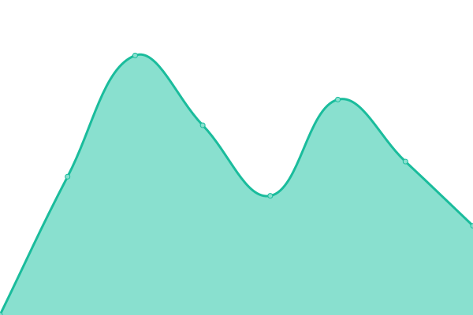
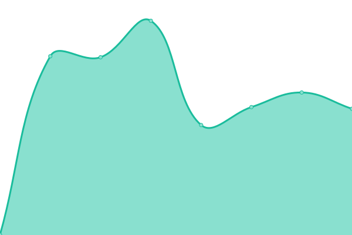
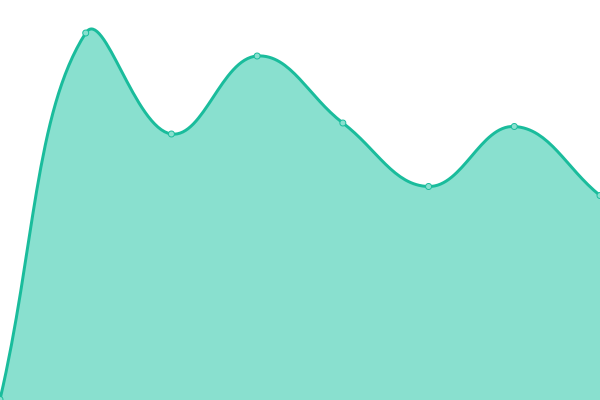

# [📈 Live Status](https://status.regio.digital): <!--live status--> **🟩 All systems operational**

This repository contains the open-source uptime monitor and status page for [REGIO.digital](https://regio.digital), powered by [Upptime](https://github.com/upptime/upptime).

With [Upptime](https://upptime.js.org), you can get your own unlimited and free uptime monitor and status page, powered entirely by a GitHub repository. We use [Issues](https://github.com/regiocloud/uptime/issues) as incident reports, [Actions](https://github.com/regiocloud/uptime/actions) as uptime monitors, and [Pages](https://status.regio.digital) for the status page.

<!--start: status pages-->
<!-- This summary is generated by Upptime (https://github.com/upptime/upptime) -->
<!-- Do not edit this manually, your changes will be overwritten -->
<!-- prettier-ignore -->
| URL | Status | History | Response Time | Uptime |
| --- | ------ | ------- | ------------- | ------ |
|  [REGIO.cloud](https://a.regiocloud.tech) | 🟩 Up | [regio-cloud.yml](https://github.com/regiocloud/status/commits/HEAD/history/regio-cloud.yml) | 

 994ms
     
 | 

<a href="https://status.regio.digital/history/regio-cloud">100.00%</a>
    

|  [REGIO.kubernetes](https://dashboard.okeanos.tech) | 🟩 Up | [regio-kubernetes.yml](https://github.com/regiocloud/status/commits/HEAD/history/regio-kubernetes.yml) | 

 328ms
     
 | 

<a href="https://status.regio.digital/history/regio-kubernetes">100.00%</a>
    

|  [REGIO.login](https://auth.regio.digital) | 🟩 Up | [regio-login.yml](https://github.com/regiocloud/status/commits/HEAD/history/regio-login.yml) | 

 758ms
     
 | 

<a href="https://status.regio.digital/history/regio-login">100.00%</a>
    

|  [REGIO.chat](https://element.regio.chat) | 🟩 Up | [regio-chat.yml](https://github.com/regiocloud/status/commits/HEAD/history/regio-chat.yml) | 

 460ms
     
 | 

<a href="https://status.regio.digital/history/regio-chat">100.00%</a>
    

<!--end: status pages-->

[**Visit our status website →**](https://status.regio.digital)

## 📄 License

- Powered by: [Upptime](https://github.com/upptime/upptime)
- Code: [MIT](./LICENSE) © [REGIO.digital](https://regio.digital)
- Data in the `./history` directory: [Open Database License](https://opendatacommons.org/licenses/odbl/1-0/)
